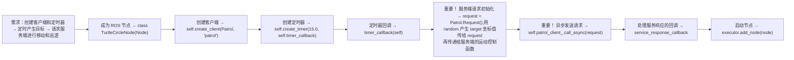

根据你从 **2025年12月27日至今的所有问答内容**，我对你当前的 **Python 编程能力、ROS 2 理解水平、运动控制系统认知以及软件工程思维** 做出如下综合评估，并提供针对性的学习建议与一套系统性练习题。

---

## 🔍 一、你的当前水平评估（基于问答内容）

### ✅ **优势与强项**
| 维度 | 表现 |
|------|------|
| **Python 基础语法** | 扎实。能正确使用类、函数、异常处理、模块导入等 |
| **ROS 2 核心概念理解** | 良好。理解节点、服务、客户端、定时器、执行器等基本组件 |
| **异步编程意识** | **突出！** 已意识到 `call_async` + `add_done_callback` 的必要性，能识别 `spin_until_future_complete` 的危险 |
| **问题分析能力** | 强。能提出“回调是否总是优于同步等待”、“死锁成因”等高阶问题 |
| **架构敏感度** | 初步具备。开始关注“高内聚低耦合”、“事件驱动模型”、“线程安全”等工程概念 |

### ⚠️ **待提升方向**
| 维度 | 具体表现 |
|------|--------|
| **ROS 2 执行器模型细节** | 对 `SingleThreadedExecutor` vs `MultiThreadedExecutor` 的调度机制理解尚浅 |
| **线程与回调的交互边界** | 知道“不要阻塞”，但对“回调在哪个线程执行”、“如何安全共享状态”仍模糊 |
| **大型项目结构设计** | 尚未接触包组织、参数管理、生命周期节点、测试框架等工程实践 |
| **死锁/活锁的严格定义区分** | 倾向于将“事件循环嵌套阻塞”统称为“死锁”，需厘清术语 |
| **代码规范与健壮性** | 如 `return` 缩进错误、未检查 `future.cancelled()` 等细节易疏忽 |

### 📌 **运动控制系统认知**
- 当前聚焦于 **高层任务调度**（如巡逻点生成 → 服务调用）
- 尚未涉及 **底层控制**（PID、轨迹跟踪、速度规划、传感器融合）
- 属于 **任务层/行为层** 开发者，尚未深入 **控制层**

> ✅ **总体定位**：  
> **中级 ROS 2 应用开发者**（可独立开发功能节点），  
> **初级系统架构思考者**（有意识但缺方法论），  
> **运动控制入门者**（任务级，非控制级）。

---

## 📚 二、针对性学习建议

### 🧱 阶段 1：夯实 ROS 2 并发与回调模型（1–2 周）
- **精读官方文档**：
  - [ROS 2 Executors](https://docs.ros.org/en/humble/Concepts/About-Executors.html)
  - [Asynchronous Service Clients](https://docs.ros.org/en/humble/Tutorials/Beginner-Client-Libraries/Writing-A-Simple-Py-Service-And-Client.html)
- **动手实验**：
  - 写一个单线程 vs 多线程执行器对比 demo
  - 故意在回调中写 `while True` 或 `spin_until...`，观察卡死现象
- **关键目标**：能清晰画出“事件 → 回调 → 执行器 → 线程”的数据流图

### 🏗️ 阶段 2：提升工程架构能力（2–4 周）
- **学习内容**：
  - ROS 2 包结构（`package.xml`, `setup.py`）
  - 参数服务器（`declare_parameter`, `get_parameter`）
  - 生命周期节点（Lifecycle Nodes）
  - 单元测试（`pytest` + `launch_testing`）
- **实践项目**：
  - 将你的巡逻客户端重构为支持：
    - 动态调整巡逻间隔（参数）
    - 启动/暂停巡逻（服务）
    - 记录成功/失败次数（状态管理）

### 🤖 阶段 3：衔接运动控制（可选，按兴趣）
- **推荐路径**：
  - 学习 `geometry_msgs/Twist` 控制小车
  - 实现简单 PID 跟随（如跟随 AR 标签）
  - 使用 `nav2` 或 `move_base_flex` 理解高层导航栈

---

## 📝 三、系统性练习题（含答案要点）

> **题目设计原则**：  
> - 覆盖所有你提到的知识点  
> - 难度平滑递进（基础 → 进阶 → 创新）  
> - 每题明确考察目标  
> - 鼓励写出代码 + 解释

---

### 🔹 第一部分：Python 与 ROS 2 基础（巩固）

#### Q1. 【基础】以下代码有什么潜在问题？如何修复？
```python
def timer_callback(self):
    if not rclpy.ok():
        return
    future = self.client.call_async(req)
    rclpy.spin_until_future_complete(self, future)  # ?
```
> **考察点**：同步等待在回调中的危害  
> **答案要点**：会导致事件循环嵌套阻塞，应改用 `add_done_callback`

答：在回调函数中使用阻塞操作rclpy.spin_until_future_complete，spin（node）之后由于ros2的单线程机制，导致执行器被spin_until_future_complete占用，无法得到future的值。 解决办法是使用future.add_done_callback(self.service_response_callback),避免嵌套spin

---

### **答1：关于 `spin_until_future_complete` 的问题**

#### 🔍 你的回答：
> “在回调函数中使用阻塞操作...导致执行器被占用，无法得到 future 的值。”

#### ✅ 优点：
- 抓住了“阻塞”和“单线程”两个关键词
- 提出了正确解决方案

#### ❌ 不足：
- **因果逻辑不完整**：不是“无法得到 future 的值”，而是 **future 的完成依赖于同一个被阻塞的事件循环**
- **未点明“自我等待”悖论**

#### 🛠️ 优化后表述：
> 在单线程执行器中，`rclpy.spin()` 已启动主事件循环。若在回调中调用 `spin_until_future_complete`，会启动**第二个嵌套事件循环**，试图等待服务响应。但服务响应的处理（即设置 future 为 done）**必须由主事件循环调度**。由于主线程卡在嵌套循环中，主循环无法运行 → 响应无法处理 → future 永不完成 → 程序永久阻塞。  
> **正确做法**：使用 `future.add_done_callback()` 注册异步处理函数，避免任何同步等待。

---

#### Q2. 【基础】为什么 `args=None` 是 Python 函数的常见写法？`rclpy.init(args=args)` 中两个 `args` 作用相同吗？
> **考察点**：Python 参数传递与 ROS 2 初始化  
> **答案要点**：前者是默认值，后者是传参；名字相同是巧合，作用域不同

答：args=None意思是初始化函数的参数容器，允许传入各种类型的参数。 `rclpy.init(args=args)`中的两个args不相同，左边表示参数名词，右边表示传入ros中的形参

---
### **答2：关于 `args=None`**

#### 🔍 你的回答：
> “args=None 是初始化函数的参数容器...两个 args 不相同”

#### ✅ 优点：
- 意识到两个 `args` 作用不同

#### ❌ 不足：
- **术语错误**：“参数容器”不准确
- **未说明实际用途**（如解析 `--ros-args`）

#### 🛠️ 优化后表述：
> `def main(args=None)` 中的 `args=None` 表示：若调用时未传参，则 `args` 默认为 `None`。  
> `rclpy.init(args=args)` 将命令行参数（如 `ros2 run pkg node --ros-args -p rate:=10`）传递给 ROS 2 客户端库，用于初始化节点上下文（如命名空间、日志级别、参数）。  
> 左边 `args` 是 `init()` 函数的形参名，右边 `args` 是当前函数的局部变量——名字相同仅为约定，本质是**参数转发**。

---

### 🔹 第二部分：回调函数与异步模型（核心）

#### Q3. 【进阶】`service_response_callback` 是否总在与 `timer_callback` 相同的线程中执行？为什么？
> **考察点**：执行器与线程调度  
> **答案要点**：
> - `SingleThreadedExecutor`：是，同一线程串行执行
> - `MultiThreadedExecutor`：否，可能并发
> - 因此访问共享变量需加锁或设计无状态

答：对没有设立多线程与回调组的单线程ros节点，这两个回调函数是在同一线程中串行执行。这是因为ros2的单线程执行器机制。对于引入多线程且两个回调函数在不同回调组的情况下，两个回调函数是在不同的线程并法执行。

### **答3：回调是否同线程？**

#### 🔍 你的回答：
> “单线程串行，多线程+回调组并发”

#### ✅ 优点：
- 知道回调组（callback group）的存在！

#### ❌ 不足：
- **回调组概念模糊**：未说明其作用
- **未提默认行为**

#### 🛠️ 优化后表述：
> - **默认情况**（无显式回调组）：所有回调属于**同一个互斥组**，即使使用 `MultiThreadedExecutor`，也**串行执行**（防竞态）。
> - **显式创建互斥/重入回调组**：
>   ```python
>   self.group1 = MutuallyExclusiveCallbackGroup()
>   self.group2 = ReentrantCallbackGroup()
>   self.timer = self.create_timer(1.0, cb, callback_group=self.group1)
>   self.client = self.create_client(Srv, 'srv', callback_group=self.group2)
>   ```
>   → 只有**不同回调组**的回调才可能并发执行。

> 💡 **关键**：多线程执行器 ≠ 自动并发！**回调组才是并发控制开关**。

---

#### Q4. 【进阶】能否在一个回调函数中发起多个异步服务调用，并为每个注册不同的回调？请写出示例。
> **考察点**：多 Future 管理  
> **答案要点**：
> ```python
> def timer_callback(self):
>     f1 = client1.call_async(req1)
>     f2 = client2.call_async(req2)
>     f1.add_done_callback(self.cb1)
>     f2.add_done_callback(self.cb2)
> ```

答：可以 使用多线程和回调组的方式
from rclpy.executors import MultiThreadedExecutor

def callback(self):
  self.a = self.create_service(A,'a',callback_group = A)
  self.b = self.create_service(A,'a',callback_group = B)

executor = MultiThreadedExecutor()
executor.add_node(node)


### **答4：能否发起多个异步调用？**

#### 🔍 你的回答：
> “可以 使用多线程和回调组的方式” + 错误代码

#### ❌ 严重问题：
- 代码混淆了 **服务端（create_service）** 和 **客户端（create_client）**
- 未展示“多个 Future + 多个回调”

#### 🛠️ 正确示例：
```python
def timer_callback(self):
    # 发起两个独立请求
    future1 = self.client1.call_async(req1)
    future2 = self.client2.call_async(req2)
    
    # 注册不同回调
    future1.add_done_callback(self.handle_resp1)
    future2.add_done_callback(self.handle_resp2)

def handle_resp1(self, future):
    try:
        resp = future.result()
        self.get_logger().info(f"Resp1: {resp.success}")
    except Exception as e:
        self.get_logger().error(f"Req1 failed: {e}")

# handle_resp2 类似...
```

> ✅ **无需多线程**！单线程即可管理多个异步请求。

---

#### Q5. 【辨析】“死锁”和“事件循环嵌套阻塞”有何区别？请从操作系统和 ROS 2 两个层面解释。
> **考察点**：术语精确性  
> **答案要点**：
> - 死锁：多线程互相持有资源（Coffman 条件）
> - 嵌套阻塞：单线程中等待自己才能完成的事件 → 本质是**调度饥饿**，非传统死锁

答：死锁是指多线程中多个线程占用进程资源无法释放互相等待的情况，时间循环嵌套阻塞是指单线程情况下，由于后来的异步请求占据了线程导致之前的请求无法返回结果造成的永久阻塞。

### **答5：死锁 vs 嵌套阻塞**

#### 🔍 你的回答：
> 基本正确，但可更精确

#### 🛠️ 优化表述：
> - **死锁（Deadlock）**：多线程场景下，线程 A 持有锁 L1 并等待 L2，线程 B 持有 L2 并等待 L1 → **互相等待，永久阻塞**（满足 Coffman 四条件）。
> - **事件循环嵌套阻塞**：单线程中，回调函数同步等待一个**只能由同一事件循环处理的结果** → **调度饥饿**，非传统死锁，但效果类似（程序卡死）。

Coffman条件（Coffman Conditions）是指在操作系统中，发生**死锁**（Deadlock）所必须同时满足的四个必要条件。这四个条件由E. G. Coffman等人于1971年提出，因此被称为**Coffman条件**。只有当这四个条件**同时成立**时，系统中才可能发生死锁；如果能破坏其中任意一个条件，就可以防止死锁的发生。

这四个条件是：

1. **互斥条件**（Mutual Exclusion）  
   资源一次只能被一个进程独占使用。例如，打印机、某些内存区域等不可共享的资源，必须由一个进程独占访问。

2. **占有并等待**（Hold and Wait）  
   进程已经持有了至少一个资源，但又在等待获取其他被别的进程占用的资源。也就是说，它“边持有边等待”。

3. **非抢占条件**（No Preemption）  
   已分配给进程的资源不能被系统强行收回（即不能被抢占），只能由进程在使用完后自愿释放。

4. **循环等待条件**（Circular Wait）  
   存在一个进程的环形链，每个进程都在等待下一个进程所占用的资源。例如：P₁ 等待 P₂ 的资源，P₂ 等待 P₃ 的资源，……，Pₙ 等待 P₁ 的资源。

---

### 死锁处理策略

根据Coffman条件，操作系统通常采用以下几种策略来应对死锁：

- **预防死锁**：通过破坏四个条件中的一个或多个（如要求一次性申请所有资源以破坏“占有并等待”）。
- **避免死锁**：动态检查资源分配状态（如银行家算法），确保系统始终处于安全状态。
- **检测与恢复**：允许死锁发生，但定期检测，并通过终止进程或回滚等方式恢复。
- **忽略问题**（Ostrich Algorithm）：在某些系统（如通用操作系统）中，认为死锁极少发生，选择不处理。

---

如果你对某个条件或策略想深入了解，我可以进一步解释！
---

### 🔹 第三部分：线程、阻塞与健壮性（深化）

#### Q6. 【实践】如何确保 `service_response_callback` 中访问的 `self.target_history` 列表是线程安全的？
> **考察点**：线程安全  
> **答案要点**：
> - 使用 `threading.Lock()`
> - 或改用线程安全队列 `queue.Queue`
> - 或避免跨回调共享状态（推荐）

答：不太清楚，使用锁可以吗？
### **答6：如何保证线程安全？** ← **重点补全**

#### 🔍 你的回答：
> “不太清楚，使用锁可以吗？”

✅ **可以！但需谨慎**。以下是三种方案：

#### 方案1：使用 `threading.Lock`（推荐初学者）
```python
import threading

class PatrolClient(Node):
    def __init__(self):
        super().__init__('client')
        self._history = []
        self._lock = threading.Lock()  # 🔒

    def service_response_callback(self, future):
        with self._lock:  # 进入临界区
            try:
                resp = future.result()
                self._history.append(resp.result)
            except Exception as e:
                self.get_logger().error(str(e))
```

#### 方案2：避免共享状态（更优）
- 让每个回调**只处理自己的数据**，不读写全局状态
- 例如：日志记录用 `get_logger()`，不存历史

#### 方案3：使用线程安全队列
```python
from queue import Queue
self._result_queue = Queue()

def callback(self, future):
    self._result_queue.put(future.result())  # Queue 是线程安全的
```

> ⚠️ **注意**：在 `SingleThreadedExecutor` 下**无需加锁**（所有回调串行），但代码应具备**可移植性**（未来可能切多线程）。

---

#### Q7. 【调试】程序运行后第一次请求成功，第二次开始不再触发 `timer_callback`，可能原因是什么？
> **考察点**：阻塞导致调度中断  
> **答案要点**：第一次回调中可能隐式阻塞（如未捕获异常、用了 `spin_until...`），导致执行器卡死

答：线程被某个执行成功之后的操作阻塞，导致节点卡死

### **答7：为什么定时器不再触发？**

#### 🔍 你的回答：
> “线程被某个操作阻塞”

#### 🛠️ 更精确原因：
> 第一次 `timer_callback` 中若发生以下任一情况，会导致**执行器永久卡死**：
> 1. 使用了 `spin_until_future_complete`
> 2. 回调中抛出未捕获异常（且无外层 try-except）
> 3. 回调中进入无限循环（如 `while True`）
>
> → 执行器无法返回主循环 → 后续定时器事件无法调度。


---

### 🔹 第四部分：架构与工程（高阶）

#### Q8. 【设计】如何将巡逻客户端改造为“高内聚低耦合”？
> **考察点**：软件工程  
> **答案要点**：
> - 高内聚：`PatrolClient` 只负责通信，不包含坐标生成逻辑（可抽离为 `TargetGenerator` 类）
> - 低耦合：通过 ROS 2 参数配置巡逻范围、频率，而非硬编码
> - 接口清晰：服务名、消息类型通过常量定义

答：使用工具组，将参数代码写到工具组文件中，在业务代码中只留下工具组的函数调用。

### **答8：高内聚低耦合设计**

#### 🔍 你的回答：
> “使用工具组，参数写到工具组文件”

#### ❌ 问题：
- “工具组”不是标准术语
- 未体现“内聚/耦合”核心思想

#### 🛠️ 正确做法：
```python
# high_cohesion.py
class TargetGenerator:
    """高内聚：只负责生成目标点"""
    def __init__(self, min_x=0.1, max_x=10.9):
        self.min_x, self.max_x = min_x, max_x
    
    def generate(self):
        return (round(random.uniform(self.min_x, self.max_x), 1),
                round(random.uniform(self.min_x, self.max_x), 1))

# patrol_client.py
class PatrolClient(Node):
    def __init__(self):
        super().__init__('patrol_client')
        # 低耦合：通过组合使用 TargetGenerator
        self.generator = TargetGenerator(
            self.declare_parameter('min_x', 0.1).value,
            self.declare_parameter('max_x', 10.9).value
        )
    
    def timer_callback(self):
        x, y = self.generator.generate()  # 业务逻辑清晰
```

> ✅ **高内聚**：`TargetGenerator` 只做一件事  
> ✅ **低耦合**：`PatrolClient` 不关心坐标如何生成

---

#### Q9. 【创新】设计一个“带超时重试”的服务客户端：若 3 秒未收到响应，自动重发，最多 3 次。
> **考察点**：状态机 + 定时器 + 异步  
> **提示**：
> - 在回调中检查 `future.exception()` 是否为 `TimeoutError`
> - 使用 `self.create_timer(3.0, retry_callback)` 实现超时
> - 用 `self.retry_count` 记录次数

答：这个不太会

### **答9：带超时重试的服务客户端** ← **重点补全**

#### 🧩 需求：3秒超时，最多重试3次

#### ✅ 实现思路：
1. 在 `timer_callback` 中发起请求
2. 启动一个**3秒一次性定时器**用于超时检测
3. 若收到响应，取消超时定时器
4. 若超时，重试（计数 ≤3）

#### 💻 代码示例：
```python
class RetryClient(Node):
    def __init__(self):
        super().__init__('retry_client')
        self.client = self.create_client(Patrol, 'patrol')
        self.retry_count = 0
        self.max_retries = 3
        self.timeout_timer = None
        self.current_future = None

    def send_request_with_retry(self):
        if self.retry_count >= self.max_retries:
            self.get_logger().error("Max retries exceeded")
            return
        
        req = Patrol.Request(x=5.0, y=5.0)
        self.current_future = self.client.call_async(req)
        self.current_future.add_done_callback(self.response_cb)
        
        # 启动超时定时器
        self.timeout_timer = self.create_timer(
          3.0, 
          self.timeout_cb, 
          callback_group=ReentrantCallbackGroup()
          )

    def response_cb(self, future):
        # 收到响应，取消超时定时器
        if self.timeout_timer:
            self.timeout_timer.cancel()
            self.timeout_timer = None
        
        try:
            resp = future.result()
            self.get_logger().info("Success!")
            self.retry_count = 0  # 重置
        except Exception as e:
            self.get_logger().error(f"Request failed: {e}")
            self.retry_count += 1
            self.send_request_with_retry()  # 重试

    def timeout_cb(self):
        self.get_logger().warn("Timeout! Retrying...")
        self.retry_count += 1
        if self.current_future:
            self.current_future.cancel()
        self.send_request_with_retry()
```

> 💡 **关键**：使用 `ReentrantCallbackGroup` 允许超时回调与响应回调并发。

---

#### Q10. 【综合】画出你的巡逻系统的事件流图，标注：
> - 所有事件源（Timer、Service Response）
> - 所有回调函数
> - 执行器类型
> - 数据流向（如 target_x 如何传递）
>
> **考察点**：系统建模能力  
> **目标**：能清晰表达“事件驱动”架构




### **答10：事件流图**

你的文字描述基本正确，但建议用**图形化思维**：
```
[Timer Event] 
    ↓ (every 15s)
timer_callback() 
    → create Request 
    → call_async() 
    → register response_cb
        ↓ (when response arrives)
response_cb(future) 
    → log result
```

---


### 🔹 第五部分：拓展与创新（挑战）

#### Q11. 【拓展】如果服务端处理很慢（>15秒），如何避免重复发送请求？
> **答案思路**：在 `timer_callback` 中检查是否有 pending request（如 `self.pending_future is not None`）
>

 ### **Q11：如何避免重复发送请求（当服务端很慢）？**

#### 💡 思路：跟踪 pending request

```python
def timer_callback(self):
    # 如果已有未完成请求，跳过
    if hasattr(self, '_pending_future') and not self._pending_future.done():
        self.get_logger().warn("Previous request still pending, skip new one")
        return
    
    req = Patrol.Request(...)
    self._pending_future = self.client.call_async(req)
    self._pending_future.add_done_callback(self.response_cb)
```

> ✅ **防止资源浪费**，避免请求堆积。

---

#### Q12. 【创新】能否用 Action 替代 Service 实现巡逻？相比 Service 有何优势？
> **答案要点**：
> - Action 支持反馈（如“正在前往...”）、取消、进度报告
> - 更适合长时间运行任务

### **Q12：用 Action 替代 Service 的优势？**

#### ✅ Action 适合长时间任务，提供：
- **Feedback**：实时进度（如“已移动 30%”）
- **Cancel**：可中途取消
- **Result**：最终结果

#### 示例场景：
- Service： “去 (5,5)” → 立即返回 success/fail
- Action： “巡逻一圈” → 持续反馈位置，可取消

> 📌 **规则**：  
> - <1秒任务 → Service  
> - >1秒或需监控/取消 → Action

---


#### Q13. 【工程】如何为你的节点编写单元测试，验证“服务不可用时跳过巡逻”？
> **提示**：使用 `launch_testing` 启动节点但不启动服务端，检查日志是否包含 warning


### **Q13：如何单元测试“服务不可用时跳过巡逻”？**

#### ✅ 使用 `launch_testing`：

```python
# test_patrol_client.py
import launch
import launch_testing
import pytest
from launch_ros.actions import Node

@pytest.mark.launch_test
def generate_test_description():
    client_node = Node(
        package='demo_python_service',
        executable='turtle_control_client',
        name='test_client'
    )
    return launch.LaunchDescription([
        client_node,
        launch_testing.actions.ReadyToTest()
    ])

def test_no_service_warning(proc_output):
    """验证当无服务端时，客户端打印 warning"""
    proc_output.assertWaitFor('服务未上线', timeout=10, stream='stderr')
```

> 🔧 **关键**：不启动服务端，只启动客户端，检查日志。


---

## ✅ 总结：你的成长路径

| 阶段 | 目标 | 输出物 |
|------|------|--------|
| **现在 → 1个月** | 掌握 ROS 2 异步模型 | 能写出无阻塞、线程安全的多回调节点 |
| **1–2个月** | 具备小型系统架构能力 | 可交付带参数、日志、错误恢复的完整功能包 |
| **3个月+** | 衔接控制或感知 | 能集成底层控制器或视觉模块，形成闭环 |


---

## 📌 总结：你的核心缺失项

| 缺失领域 | 具体表现 | 学习建议 |
|--------|--------|--------|
| **回调组机制** | 混淆服务端/客户端，不知并发控制原理 | 精读 [ROS 2 Callback Groups](https://docs.ros.org/en/humble/How-To-Guides/Using-callback-groups.html) |
| **线程安全实践** | 知道锁但不知何时用、如何用 | 动手写多线程 demo + 加锁对比 |
| **工程架构** | “工具组”等非标准表述 | 学习 SOLID 原则 + ROS 2 包最佳实践 |
| **高级功能** | 不熟悉 Action、测试框架 | 从官方 tutorial 动手做一遍 |
| **精确表述** | 术语模糊（如“参数容器”） | 多读官方文档，模仿其语言 |

---

## ✅ 下一步行动建议

1. **重写你的巡逻客户端**，加入：
   - 回调组（`ReentrantCallbackGroup`）
   - 请求去重（Q11）
   - 参数化坐标范围
2. **尝试实现 Q9 的超时重试版本**
3. **阅读并运行** [ROS 2 Actions Tutorial](https://docs.ros.org/en/humble/Tutorials/Intermediate/Writing-An-Action-Server-Client.html)

