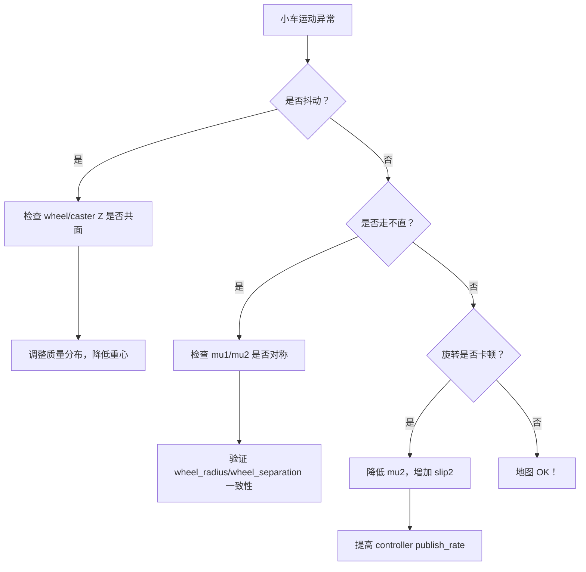

当然可以！以下是根据你提供的调试经验、我们之前的深度问答（包括 odom 飘移、TF 跳变、静摩擦、轮子接地、caster 干扰等问题），整理而成的一份 **结构清晰、可操作性强、面向实践的 Gazebo + ROS 2 小车调试经验笔记**。适用于搭载 **激光雷达（Lidar）和摄像头** 的差速驱动机器人，在仿真中实现 **平滑运动、稳定转向、高质量全局地图构建与 RViz2 点云同步显示**。

---

# 🐟 Gazebo 中调试雷达/摄像头小车：平滑运动、稳定建图与 RViz2 可视化经验笔记

> **目标**：在 Gazebo 仿真中，让差速小车平滑行走/旋转，激光雷达稳定扫描，最终在 RViz2 中生成 **无重叠、无撕裂、高精度的全局点云地图**。

---

## ✅ 一、环境准备：快速复用“小鱼房间”世界

为节省时间，直接使用已调优的仿真环境：

```bash
# 克隆官方示例（含优化后的 world 文件）
git clone https://gitee.com/fishros/ros2bookcode.git
cd ros2bookcode/chapt6/chapt6_ws/src/fishbot_description/world
```

将 `world` 文件夹中的 `.world` 和 `.sdf` 文件拷贝到你的项目 `worlds/` 目录下。

> 💡 这些世界文件已包含合理光照、地面材质、障碍物布局，避免因环境导致传感器噪声或物理异常。

---

## ⚙️ 二、核心问题与调试策略

### 🔧 问题1：小车运动时“前后一抖一抖”（高频震荡）

#### 📌 原因：
- **动力轮（wheel）与万向轮（caster）不在同一水平面** → 接地不一致，导致车身弹跳。
- 或 **上部传感器过重，重心过高** → 物理不稳定。

#### ✅ 解决方案：

1. **精确对齐 wheel 与 caster 的 Z 坐标**  
   在 `fishbot.urdf.xacro` 中：
   ```xml
   <!-- 假设 wheel 半径 = 0.032m，base_link 底部在 Z = -0.06 -->
   <xacro:wheel_xacro wheel_name="left_wheel" xyz="0 0.10 -0.06" />
   <xacro:wheel_xacro wheel_name="right_wheel" xyz="0 -0.10 -0.06" />

   <!-- caster 球心 Z 应使球体底部接触地面（Z=0） -->
   <!-- 若 caster 半径 = 0.016m，则球心 Z = -0.016 -->
   <xacro:caster_xacro caster_name="front_caster" xyz="0.08 0 -0.076" />
   ```

2. **调整质量分布，降低重心**  
   - 减轻 `lidar_link`、`camera_link` 的质量（如从 `0.5kg` → `0.1kg`）
   - 适当增加 `wheel_link` 质量（如 `0.1kg` → `0.2kg`）
   ```xml
   <!-- 示例：轻量化传感器 -->
   <xacro:cylinder_inertia m="0.1" r="0.03" h="0.05" /> <!-- Lidar -->
   ```

---

### 🔧 问题2：小车走不直 / 旋转卡顿（静摩擦效应）

#### 📌 原因：
- **wheel 摩擦系数过高（如 mu1=20）** → 静摩擦阈值大，需较大 torque 才能启动。
- 启动后突然释放 → velocity 跳变（0 ↔ 0.5 ↔ 0...）→ 控制器输出震荡。

#### ✅ 解决方案：**合理设置 Gazebo 接触参数**

##### 动力轮（wheel）配置：
```xml
<gazebo reference="${wheel_name}_link">
  <mu1>4.0</mu1>        <!-- 纵向摩擦：1.0~2.0 足够提供驱动力 -->
  <mu2>2.0</mu2>       <!-- 侧向摩擦：极低，保证原地旋转顺滑 -->
  <fdir1>1 0 0</fdir1>  <!-- 关键！定义 mu1 方向为前进方向（X轴） -->
  <kp>1e6</kp>          <!-- 接触刚度：1e6 ~ 1e7，避免 1e9 导致震荡 -->
  <kd>100.0</kd>        <!-- 阻尼：帮助吸收冲击 -->
  <slip1>0.01</slip1>   <!-- 允许微小纵向滑移，绕过静摩擦 -->
  <slip2>0.01</slip2>   <!-- 允许微小侧向滑移 -->
</gazebo>
```

##### 万向轮（caster）配置：
```xml
<gazebo reference="${caster_name}_link">
  <mu1>0.01</mu1>       <!-- caster 应几乎无摩擦 -->
  <mu2>0.01</mu2>
  <kp>1e6</kp>
  <kd>100.0</kd>
</gazebo>
```

> ✅ 效果：小车前进/后退平滑，原地旋转无“一顿一顿”感。

---

## 📡 三、提升传感器数据质量

### 🔧 提高 Laser Scan 发布频率

在 `lidar` 的 Gazebo 插件中（通常在 `sensor.urdf.xacro`）：
```xml
<update_rate>100.0</update_rate>   <!-- 默认可能为 20Hz，提高到 100~300Hz -->
<ray>
  <scan>
    <horizontal>
      <samples>360</samples>
      <resolution>1</resolution>
    </horizontal>
  </scan>
  <range>
    <min>0.10</min>
    <max>10.0</max>
    <resolution>0.01</resolution>
  </range>
</ray>
```

> 💡 更高频率 + 更高分辨率 → SLAM 输入更连续，地图边缘更锐利。

---

## 🗺 四、SLAM 建图与 RViz2 可视化

### 1. 使用 `slam_toolbox` 或 `nav2_bringup` 启动建图
确保 launch 文件中：
```yaml
use_sim_time: true
map_topic: /map
```

### 2. 在 RViz2 中添加以下显示项：
- **LaserScan**：`/scan`
- **PointCloud2**（如有 3D 点云）：`/points`
- **Map**：`/map`
- **TF**：启用 `odom → base_footprint → sensor_links`
- **RobotModel**：验证模型是否正确加载

### 3. 验证地图质量
- **理想地图**：房间边界闭合、无重影、角落清晰
- **问题地图**：多层叠加、边缘模糊 → 回溯检查 **odometry 稳定性**

---

## 🧪 五、调试 checklist（快速排查）

| 现象 | 检查点 |
|------|--------|
| 小车不动 | wheel 是否接地？`mu1` 是否太小？控制器 torque 是否足够？ |
| 走直线偏航 | 左右 wheel 摩擦是否对称？caster 是否卡住？ |
| 旋转卡顿 | `mu2` 是否太大？是否缺少 `<slip2>`？ |
| 地图重叠 | odom 是否跳变？检查 TF 树是否干净（`tf2_tools view_frames`） |
| 激光闪烁 | `update_rate` 是否太低？Gazebo physics step 是否太粗？ |

---

## ✅ 六、最终效果

完成上述调试后，你的小车将具备：

- ✅ **平滑直线运动**（无偏航、无抖动）
- ✅ **丝滑原地旋转**（无卡顿、无跳跃）
- ✅ **稳定 odom 输出**（TF 不飘、不跳变）
- ✅ **高质量全局地图**（SLAM 无累积误差）
- ✅ **RViz2 实时同步**（点云 + 激光 + 地图 + 机器人模型）

---

> 📌 **经验总结**：  
> **Gazebo 仿真的稳定性 = 合理的物理参数 + 精确的几何安装 + 适度的摩擦与阻尼**。  
> 不要追求“绝对真实”，而要追求“足够稳定以支持导航任务”。

---

当然可以！在你已有的扎实调试经验基础上，我将补充 **更深入、更系统化的细节**，特别聚焦于：

- **差速控制器（`diff_drive_controller`）输入/输出的稳定性保障**
- **Gazebo 物理仿真与 ROS 2 控制器之间的耦合调优**
- **如何从“能动”进阶到“平滑、精准、可重复”的运动控制**

这些内容源于 ROS 2 + Gazebo 的底层机制和大量工程实践，适用于所有差速轮机器人仿真项目。

---

# 🐟 Gazebo 中调试雷达/摄像头小车：平滑运动、稳定建图与 RViz2 可视化经验笔记（增强版）

> **目标**：不仅让小车“能走”，更要“走得稳、转得准、停得住”，为 SLAM、导航、路径跟踪提供可靠底层支持。


## ⚙️ 二、核心问题与深度调试策略

### 🔧 补充1：**确保 `base_footprint` 是 TF 树的“地面锚点”**

#### ❌ 错误做法：
```xml
<parent link="base_footprint"/>
<child link="base_link"/>
```
→ Gazebo 以无质量虚拟 link 为根 → 物理积分不稳定 → odom 跳变。

#### ✅ 正确做法：
```xml
<!-- base_link 为物理根（有质量、惯性） -->
<link name="base_link" />
<link name="base_footprint" />

<joint name="base_footprint_joint" type="fixed">
  <origin xyz="0 0 -${wheel_radius}" rpy="0 0 0" />
  <parent link="base_link" />
  <child link="base_footprint" />
</joint>
```
> 💡 `base_footprint` 必须是 **`base_link` 的子节点**，且 Z 偏移 = `-wheel_radius`（若 base_link 中心在 wheel 轴线上）。

#### 验证命令：
```bash
ros2 run tf2_tools view_frames
```
✅ 正确 TF 树：
```
odom
 └── base_footprint
      └── base_link
           ├── left_wheel_link
           ├── right_wheel_link
           └── lidar_link
```

---

### 🔧 补充2：**差速控制器输入/输出稳定性关键参数**

你的控制器 YAML（如 `nav2_params.yaml`）中必须包含以下关键项：

```yaml
controller_manager:
  ros__parameters:
    update_rate: 100  # 控制器内部更新频率（Hz）

fishbot_diff_drive_controller:
  ros__parameters:
    # —— 输入接口 ——
    command_interface: ["velocity"]  # 推荐使用 velocity，非 effort
    state_interface: ["position", "velocity"]

    # —— 运动学参数（必须与 URDF 一致！）——
    wheel_separation: 0.2          # 两轮间距（m）
    wheel_radius: 0.032            # 轮子半径（m）

    # —— 输出平滑性 ——
    publish_rate: 100.0            # /odom 发布频率（建议 ≥50 Hz）
    open_loop: false               # false 表示使用编码器反馈（仿真中即 Gazebo 真实位姿）
    enable_odom_tf: true
    odom_frame_id: "odom"
    base_frame_id: "base_footprint"

    # —— 安全限制 ——
    linear.x.has_velocity_limits: true
    linear.x.max_velocity: 0.5     # m/s
    angular.z.has_velocity_limits: true
    angular.z.max_velocity: 1.0    # rad/s
```

#### ⚠️ 关键点：
- **`wheel_radius` 和 `wheel_separation` 必须与 URDF 中几何完全一致**  
  否则：控制器计算的线速度 ≠ 实际速度 → 走不直。
- **`publish_rate` ≥ 50 Hz**：低频 odom 会导致 SLAM 积分误差放大。
- **`open_loop: false`**：即使仿真中也应启用“闭环”，读取 Gazebo 真实 joint position。

---

### 🔧 补充3：**Gazebo 物理引擎精度调优**

在 `.world` 文件或 launch 中加入：

```xml
<physics name='default_physics' default='0' type='ode'>
  <max_step_size>0.001</max_step_size>        <!-- 默认 0.001，可尝试 0.0005 提高精度 -->
  <real_time_factor>1.0</real_time_factor>
  <real_time_update_rate>1000</real_time_update_rate>
  <gravity>0 0 -9.8</gravity>
  <ode>
    <solver>
      <type>quick</type>
      <iters>50</iters>        <!-- 增加迭代次数，提高接触求解精度 -->
      <precon_iters>0</precon_iters>
      <sor>1.3</sor>           <!-- SOR 松弛因子，1.0~1.5 之间 -->
    </solver>
    <constraints>
      <cfm>0.0</cfm>
      <erp>0.2</erp>           <!-- ERP 增大可减少穿透，但过高会震荡 -->
    </constraints>
  </ode>
</physics>
```

> 💡 **`max_step_size` 越小，仿真越精确，但 CPU 开销越大**。  
> 对于差速小车，**0.001 ~ 0.0005 是推荐范围**。

---

### 🔧 补充4：**避免“控制-仿真”频率失配**

- **Gazebo physics step**: 由 `max_step_size` 决定（如 0.001 → 1000 Hz）
- **Controller update_rate**: 应 ≤ Gazebo 频率（如 100 Hz）
- **Cmd_vel 输入频率**: 发送 `/cmd_vel` 的节点（如 teleop）应 ≥ 10 Hz

#### 推荐频率链：
```
Teleop (20 Hz) 
  → diff_drive_controller (100 Hz) 
    → Gazebo physics (1000 Hz)
```

> ❌ 如果 controller 频率 > Gazebo，会导致“控制指令堆积”或插值错误。

---

### 🔧 补充5：**验证控制器实际输出 vs 期望输入**

运行后执行：
```bash
# 查看控制器是否收到命令
ros2 topic echo /cmd_vel

# 查看实际 joint 速度（应与 cmd_vel 成比例）
ros2 topic echo /joint_states

# 查看 odom 速度（应平滑）
ros2 topic echo /odom
```

#### 判断标准：
- 输入 `linear.x = 0.2` → 左右轮速度 ≈ `0.2 / 0.032 = 6.25 rad/s`
- 若实际速度波动大（如 5.0 ↔ 7.0 ↔ 5.5）→ 摩擦或物理参数仍需调整

---

### 🔧 补充6：**万向轮（caster）的终极处理方案**

如果 caster 仍导致“卡顿”，可考虑：

#### 方案A：**用球形 caster + 极低摩擦**
```xml
<collision>
  <geometry><sphere radius="0.016"/></geometry>
</collision>
<gazebo reference="caster_link">
  <mu1>0.001</mu1>
  <mu2>0.001</mu2>
</gazebo>
```

#### 方案B：**完全移除 caster，改用“虚拟支撑”**
- 在 Gazebo 中添加 `<self_collide>false</self_collide>`
- 或仅保留两个驱动轮，依靠 Gazebo 的 contact stability 维持平衡（适用于轻量模型）

> 💡 对于室内平坦地面仿真，**两个驱动轮 + 合理重心** 已足够稳定。

---

## 📊 三、调试流程图（快速决策）



---

## ✅ 四、最终效果验证清单

| 项目 | 验证方法 | 期望结果 |
|------|--------|--------|
| 平滑直线 | 发送 `cmd_vel.linear.x=0.2` 持续 5s | 小车走直线，RViz 轨迹平滑 |
| 原地旋转 | 发送 `cmd_vel.angular.z=0.5` | 旋转匀速，无停顿 |
| Odom 稳定 | `ros2 topic hz /odom` | 频率 ≈ publish_rate（如 100 Hz） |
| 地图质量 | SLAM 后观察 RViz | 房间闭合，无重影 |
| TF 树干净 | `tf2_tools view_frames` | 无重复 parent，base_footprint 在 Z=0 |

---

## 📌 总结：从“能动”到“精准控制”的关键

> **平滑运动 = 精确几何 + 合理摩擦 + 高频控制 + 物理同步**

不要只调 `mu1`，而要系统性地：
1. **对齐轮系高度**
2. **优化质量分布**
3. **匹配控制器与 URDF 参数**
4. **提升仿真与控制频率**
5. **验证输入-输出一致性**

做到这五点，你的小车不仅能画出完美地图，更能为后续的 **路径跟踪、动态避障、多机协同** 打下坚实基础。

--- 

> 🐟 **附：调试口诀**  
> “轮子接地要共面，摩擦别高要带滑；  
> 控制频率一百起，TF 树里 footprint 在底；  
> 参数一致是关键，SLAM 才能不出偏。”

祝你调试顺利，建图如丝般顺滑！