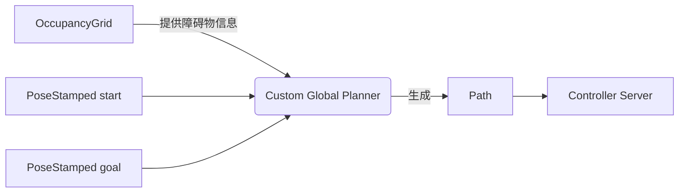

# 8.2.1 自定义规划器介绍

三个基本概念：位置，路径，占据栅格地图

```bash
ros2 interface show nav_msgs/msg/Path
# An array of poses that represents a Path for a robot to follow.

# Indicates the frame_id of the path.
std_msgs/Header header
	builtin_interfaces/Time stamp
		int32 sec
		uint32 nanosec
	string frame_id

# Array of poses to follow.
geometry_msgs/PoseStamped[] poses
	std_msgs/Header header
		builtin_interfaces/Time stamp
			int32 sec
			uint32 nanosec
		string frame_id
	Pose pose
		Point position
			float64 x
			float64 y
			float64 z
		Quaternion orientation
			float64 x 0
			float64 y 0
			float64 z 0
			float64 w 1
```

```bash
ros2 interface show geometry_msgs/msg/PoseStamped 
# A Pose with reference coordinate frame and timestamp

std_msgs/Header header
	builtin_interfaces/Time stamp
		int32 sec
		uint32 nanosec
	string frame_id
Pose pose
	Point position
		float64 x
		float64 y
		float64 z
	Quaternion orientation
		float64 x 0
		float64 y 0
		float64 z 0
		float64 w 1
```

```bash
ros2 interface show nav_msgs/msg/OccupancyGrid 
# This represents a 2-D grid map
std_msgs/Header header
	builtin_interfaces/Time stamp
		int32 sec
		uint32 nanosec
	string frame_id

# MetaData for the map
MapMetaData info
	builtin_interfaces/Time map_load_time
		int32 sec
		uint32 nanosec
	float32 resolution
	uint32 width
	uint32 height
	geometry_msgs/Pose origin
		Point position
			float64 x
			float64 y
			float64 z
		Quaternion orientation
			float64 x 0
			float64 y 0
			float64 z 0
			float64 w 1

# The map data, in row-major order, starting with (0,0).
# Cell (1, 0) will be listed second, representing the next cell in the x direction.
# Cell (0, 1) will be at the index equal to info.width, followed by (1, 1).
# The values inside are application dependent, but frequently,
# 0 represents unoccupied, 1 represents definitely occupied, and
# -1 represents unknown.
int8[] data
```

在 ROS 2 和 Navigation2（Nav2）系统中，**位置（Pose）**、**路径（Path）** 和 **占据栅格地图（Occupancy Grid Map）** 是路径规划器开发的三大基石。下面我将从**概念定义 → 消息接口详解 → 实际意义 → 开发延伸**四个层次，为你系统讲解这三个核心概念，帮助你顺利开发自定义地图规划器。

---

## 一、核心概念 1：位置（Position / Pose）

### 📌 对应 ROS 2 消息：`geometry_msgs/msg/PoseStamped`

> ✅ **本质**：一个带**时间戳**和**坐标系**的 3D 位姿（位置 + 朝向）。

### 🔍 消息结构逐行解析

```bash
std_msgs/Header header
  builtin_interfaces/Time stamp      # 时间戳：该位姿的采集/有效时间
    int32 sec                        # 秒（自 Unix epoch）
    uint32 nanosec                   # 纳秒（补充精度）
  string frame_id                    # 坐标系名称（如 "map", "odom", "base_link"）
```
> 💡 **关键点**：`frame_id` 决定了这个位姿“相对于谁”。  
> - `"map"`：全局静态地图坐标系（规划器输出通常在此系）  
> - `"odom"`：里程计坐标系（可能漂移）  
> - `"base_link"`：机器人底盘中心  

```bash
Pose pose
  Point position                     # 3D 位置 (x, y, z)
    float64 x                        # 单位：米（m）
    float64 y
    float64 z                        # 地面机器人通常 z=0
  Quaternion orientation             # 3D 朝向（四元数表示）
    float64 x 0                      # 默认值：(0,0,0,1) 表示无旋转
    float64 y 0
    float64 z 0
    float64 w 1
```
> 💡 **为什么用四元数？**  
> 避免欧拉角万向节死锁（Gimbal Lock），且计算高效。  
> 对于 2D 导航，通常只关心绕 Z 轴的旋转（yaw），可由 `atan2(2*(w*z + x*y), 1 - 2*(y² + z²))` 计算。


### 🧠 概念延伸：在规划器中的作用

- **为什么需要 stamped（带时间戳和坐标系）？**  
  因为机器人感知是**时空耦合**的。例如：你在 `"odom"` 坐标系下规划了一条路径，但地图在 `"map"` 坐标系中，必须通过 TF 进行变换。

    - **起点（Start Pose）**：机器人当前位置（来自定位模块，如 AMCL）
    - **终点（Goal Pose）**：用户指定的目标（如 RViz 中点击的位置）
    - **路径点（Waypoint）**：路径中每一个中间位姿
    
    > ✅ **规划器输入**：`start: PoseStamped`, `goal:   PoseStamped`  
    > ✅ **规划器输出**：一系列 `PoseStamped` 构成的 `Path`


- **示例：创建一个目标点**
```python
from geometry_msgs.msg import PoseStamped

def create_goal(x: float, y: float, frame: str = "map") -> PoseStamped:
    goal = PoseStamped()
    goal.header.frame_id = frame
    goal.header.stamp = self.get_clock().now().to_msg()
    goal.pose.position.x = x
    goal.pose.position.y = y
    goal.pose.position.z = 0.0
    # 朝向默认为 0（四元数 w=1）
    goal.pose.orientation.w = 1.0
    return goal
```

- **开发提示**：  
  自定义规划器输出的每个路径点都必须是 `PoseStamped`，且 `frame_id` 与输入地图一致（通常是 `"map"`）。

---

## 二、路径（Path）：一系列位置组成的“轨迹”

### 🔹 概念定义
>  ✅ **本质**：**路径（Path）** 是机器人从起点到终点需要经过的一系列**离散位姿（Poses）**，构成一条连续的轨迹。  
> 它是**全局规划器（Global Planner）的核心输出**，也是**局部规划器（Local Planner）的参考轨迹**。

### 🔍 消息结构逐行解析

```bash
std_msgs/Header header
  ...                                # 整个路径的时间戳和坐标系
  string frame_id                    # ⚠️ 必须与所有 poses 的 frame_id 一致！
```
> 💡 **重要约束**：`Path.header.frame_id` 应与 `poses[i].header.frame_id` **保持一致**（通常都设为 `"map"`）。


```bash
geometry_msgs/PoseStamped[] poses   # 路径点数组（按顺序）
  [0]: 第一个位姿（靠近起点）
  [n-1]: 最后一个位姿（靠近目标）
```
> 🔄 **顺序很重要**！局部规划器（如 NavFn）会按此顺序生成速度指令。


### 🧠 概念延伸：路径 vs 轨迹（Path vs Trajectory）
| 项目 | Path (`nav_msgs/Path`) | Trajectory (`trajectory_msgs/JointTrajectory`) |
|------|------------------------|-----------------------------------------------|
| 维度 | 仅空间（x,y,θ） | 空间 + 时间（含速度、加速度） |
| 用途 | 全局规划器输出 | 局部控制器/机械臂执行 |
| ROS 2 导航 | ✅ 标准接口 | ❌ 不用于移动机器人导航 |

> ✅ **你的自定义规划器必须发布 `nav_msgs/Path`**，否则 Navigation2 无法使用！

---

### 🛠 工程举例（构建路径）

```python
from nav_msgs.msg import Path
from geometry_msgs.msg import PoseStamped

def generate_straight_line_path(start: PoseStamped, goal: PoseStamped, num_points: int = 10) -> Path:
    path = Path()
    path.header = start.header  # 使用 start 的 frame_id 和时间戳
    
    dx = (goal.pose.position.x - start.pose.position.x) / num_points
    dy = (goal.pose.position.y - start.pose.position.y) / num_points
    
    for i in range(num_points + 1):
        pose = PoseStamped()
        pose.header = path.header
        pose.pose.position.x = start.pose.position.x + i * dx
        pose.pose.position.y = start.pose.position.y + i * dy
        pose.pose.position.z = 0.0
        pose.pose.orientation = start.pose.orientation  # 保持朝向
        path.poses.append(pose)
    
    return path
```
- **开发提示**：  
  Nav2 的 `planner_server` 期望你的规划器返回 `nav_msgs/Path`。路径点**不需要等间距**，但应足够密集以供局部规划器跟踪。

---

## 三、占据栅格地图（Occupancy Grid Map）：环境的“数字孪生”

### 🔹 概念定义
> 📌 对应 ROS 2 消息：`nav_msgs/msg/OccupancyGrid`
> ✅ **本质**：**占据栅格地图（Occupancy Grid）** 是将环境离散化为二维网格，每个格子（cell）表示该区域被占据的概率或状态。  
> 它是**路径规划的“障碍物数据库”**，所有规划算法（A*, Dijkstra, RRT* 等）都基于此进行碰撞检测。

### 🔍 消息结构逐行解析

#### (1) 元数据（MapMetaData）
```bash
builtin_interfaces/Time map_load_time  # 地图加载时间（通常忽略）
float32 resolution                      # 栅格分辨率（米/像素），如 0.05 = 5cm
uint32 width                            # 地图宽度（像素数）
uint32 height                           # 地图高度（像素数）
geometry_msgs/Pose origin               # 地图左下角（0,0）在 world 坐标系中的位姿
  Point position                        # origin.x, origin.y 是地图原点偏移
  Quaternion orientation                # 通常为 (0,0,0,1)，即无旋转
```
> 🌍 **坐标转换公式**：  
> 地图像素 `(i, j)` → 世界坐标 `(x, y)`：  
> ```
> x = origin.x + j * resolution
> y = origin.y + i * resolution
> ```
> ⚠️ 注意：**i 是行（y方向），j 是列（x方向）**，且 `(0,0)` 是左下角！
> 
#### (2) 栅格数据（data）
```bash
int8[] data  # 长度 = width * height，按行优先（row-major）存储
```
> 📊 **栅格值含义**：
> - `-1`：未知（Unknown）— 传感器未覆盖区域
> - `0`：空闲（Free）— 可安全通行
> - `1~100`：占据（Occupied）— 障碍物（值越大越确定）
> 
> 💡 **注意**：虽然类型是 `int8`，但实际值范围是 `[-1, 100]`。

---
#### 🔸 坐标 ↔ 索引转换公式（核心！）

给定世界坐标 `(x, y)`，求栅格索引 `(i, j)`：
```python
# origin 是地图左下角在 world 中的位置
dx = x - origin_x
dy = y - origin_y

# 转换为栅格坐标（注意：y 轴向上为正，但图像存储是 top-left 为 (0,0)）
i = int(dy / resolution)  # 行（y 方向）
j = int(dx / resolution)  # 列（x 方向）

# 检查边界
if 0 <= i < height and 0 <= j < width:
    index = i * width + j
    occupancy = grid.data[index]
```

> 📌 **关键陷阱**：  
> - 图像习惯：`(0,0)` 是左上角  
> - 数学/ROS 习惯：`(0,0)` 是左下角  
> **ROS OccupancyGrid 的 `origin` 定义在左下角**，所以 `i = dy / res` 直接对应行号（无需翻转）。

### 🧠 概念延伸：地图在规划器中的作用

- **为什么用 `int8` 而不用 `bool`？**  
  为了支持**概率占据**（如激光雷达融合后的不确定性）。虽然很多地图只用 {-1, 0, 100}，但接口保留了扩展性。

- **障碍物检测**：规划算法（如 A*, Dijkstra）需查询 `(x,y)` 是否可通行。
- **代价地图（Costmap）基础**：Navigation2 的 `global_costmap` 基于 `OccupancyGrid` 生成膨胀层等。

> ✅ **你的规划器必须订阅 `/map`（或 `global_costmap/costmap`）** 获取环境信息！

- **示例：检查某点是否可通行**
```python
import numpy as np
from nav_msgs.msg import OccupancyGrid

class MapAccessor:
    def __init__(self, occupancy_grid: OccupancyGrid):
        self.map = occupancy_grid
        self.data = np.array(occupancy_grid.data).reshape(
            (self.map.info.height, self.map.info.width)
        )
    
    def world_to_map(self, x: float, y: float) -> tuple[int, int]:
        """世界坐标 → 栅格坐标 (i, j)"""
        origin = self.map.info.origin
        resolution = self.map.info.resolution
        
        j = int((x - origin.position.x) / resolution)
        i = int((y - origin.position.y) / resolution)
        
        # 检查是否在地图范围内
        if 0 <= i < self.map.info.height and 0 <= j < self.map.info.width:
            return (i, j)
        else:
            raise ValueError("Point outside map")
    
    def is_occupied(self, x: float, y: float) -> bool:
        """检查世界坐标 (x,y) 是否被占据"""
        try:
            i, j = self.world_to_map(x, y)
            value = self.data[i, j]
            return value >= 1  # 1~100 为占据
        except ValueError:
            return True  # 超出地图视为障碍
```


- **开发提示**：  
  Nav2 的 `costmap_2d` 会发布 `/global_costmap/costmap`（类型 `nav_msgs/OccupancyGrid`），你的规划器应订阅此话题作为输入。

---

## 🧩 四、三者关系与规划器开发流程



### 自定义规划器开发步骤：
1. **订阅** 当前地图：`/map` (`OccupancyGrid`)或者 `/global_costmap/costmap`
2. **接收** 起点（`PoseStamped`）来自定位（`amcl_pose` 或 `tf`）和目标点（`PoseStamped`）来自用户（RViz 或 Action Goal）
3. **将起点/目标点转换为栅格坐标**
4. **在栅格地图上运行规划算法**（如 A*）
   1. 生成平滑路径（可选）
5. **将路径点从栅格坐标转回世界坐标**
6. **填充 `nav_msgs/Path` 并发布到 `/plan` 或通过 Action 返回**

---

## 🚀 自定义规划器开发下一步建议

1. **创建功能包**：
   ```bash
   ros2 pkg create my_global_planner --build-type ament_python --dependencies nav2_core nav_msgs geometry_msgs
   ```

2. **继承 `nav2_core::GlobalPlanner` 接口**（C++）或实现 Python 插件：
   ```python
   from nav2_core.global_planner import GlobalPlanner
   class MyPlanner(GlobalPlanner):
       def create_plan(self, start, goal):
           # 你的算法
           return path
   ```

3. **注册为 pluginlib 插件**（参考前文完整流程）

4. **在 `navigation.yaml` 中配置**：
   ```yaml
   global_planner:
     plugin: "my_global_planner/MyPlanner"
   ```

---
## ✅ 总结：三大概念核心要点

| 概念 | 作用 | 关键字段 | 规划器中的角色 |开发重点 |
|------|------|--------|--------------|--------|
| **位置（PoseStamped）** | 描述单点位姿 | `header.frame_id`, `pose.position`, `pose.orientation` | 起点/终点/路径点 | 坐标系一致性、四元数处理 |
| **路径（Path）** | 描述完整轨迹 | `header.frame_id`, `poses[]` | 规划结果，供局部规划器跟踪 | 路径点密度、方向连续性 |
| **占据栅格地图（OccupancyGrid）** | 描述环境障碍 | `info.resolution`, `info.origin`, `data[]` | 环境表示，用于障碍物检测 | **坐标 ↔ 索引转换**、占据阈值 |

> 💡 **记住**：  
> - 所有 `frame_id` 必须统一（通常是 `"map"`）  
> - 地图原点 `origin` 是**左下角**，不是中心！  
> - `data` 是**行优先（row-major）**，第 `i` 行第 `j` 列的索引是 `i * width + j`

掌握这三大概念及其接口细节，你就具备了开发 Nav2 自定义全局规划器的基础。下一步可研究 `nav2_core::GlobalPlanner` C++ 接口或 Python 等效实现（如 `nav2_simple_commander` 中的规划逻辑）。
